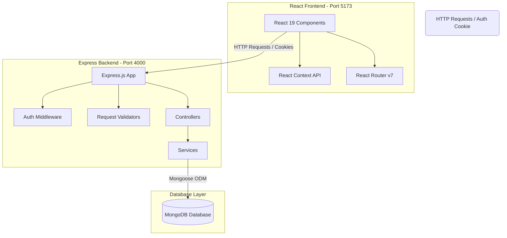

# 🚗 Uber Clone App

Welcome to the **Uber Clone App** repository! This is a modern, full-stack monorepo designed to model core ridesharing flows for both Riders (Users) and Captains (Drivers). 

The system features an **Express.js API Backend** for business logic, secure authentication, and database connectivity, coupled with a highly responsive, optimized **React 19 & Tailwind CSS v4 Frontend**.

---

## 🏗️ System Architecture

The monorepo structure separates front-end layout and routing concerns from back-end validators, security middleware, and database layers:



---

## 📂 Monorepo Structure

*   **[Backend](file:///d:/Uber%20Clone%20App/Backend/)**: Node.js & Express REST API handling authentication, validation, session revocation, and data persistence using Mongoose and MongoDB.
    *   *For full API documentation, payload schema, and endpoints, see the [Backend README](file:///d:/Uber%20Clone%20App/Backend/README.md).*
*   **[Frontend](file:///d:/Uber%20Clone%20App/Frontend/)**: Single Page Application built using React 19, Vite 8, Tailwind CSS v4, and React Router v7. Features fully interactive components like `CaptainDetails` and `RidePopUp` for driving simulations.
    *   *For route listings, wrappers, context state structure, and component details, see the [Frontend README](file:///d:/Uber%20Clone%20App/Frontend/README.md).*

---

## 🚀 Getting Started

### 📋 Prerequisites

Ensure you have the following installed on your machine:
*   [Node.js](https://nodejs.org/) (v18.x or higher recommended)
*   [MongoDB](https://www.mongodb.com/) (running locally or a MongoDB Atlas URI connection string)
*   [npm](https://www.npmjs.com/) (Node Package Manager)

---

### 🔧 Complete Local Setup

Follow these steps to run both services in development mode:

#### Step 1: Set Up & Run the Backend
1.  Navigate into the Backend folder:
    ```bash
    cd Backend
    ```
2.  Install all node modules:
    ```bash
    npm install
    ```
3.  Create your backend environment configuration file `.env` at `Backend/.env` with the following variables:
    ```env
    PORT=4000
    DB_CONNECT=mongodb://localhost:27017/uber-clone
    JWT_SECRET=your_super_secret_jwt_key
    ```
4.  Launch the development server (with automatic reload via `nodemon`):
    ```bash
    npm run dev
    ```

#### Step 2: Set Up & Run the Frontend
1.  Open a new terminal window and navigate into the Frontend folder:
    ```bash
    cd Frontend
    ```
2.  Install dependencies:
    ```bash
    npm install
    ```
3.  Create your frontend environment configuration file `.env` at `Frontend/.env` with:
    ```env
    VITE_BASE_URL=http://localhost:4000
    ```
4.  Launch the Vite development application server:
    ```bash
    npm run dev
    ```
    *The frontend web app will open at `http://localhost:5173`.*

---

## 🧪 Linters & Code Quality

*   **Linting Checks:** The frontend includes [Oxlint](https://oxc.rs/) for ultra-fast, zero-dependency validation. Run it using:
    ```bash
    npm run lint
    ```
*   **Database Management:** We recommend using [MongoDB Compass](https://www.mongodb.com/products/tools/compass) or the MongoDB Shell to inspect registered user collections, captains, and blacklisted JWT records under the `uber-clone` database.
