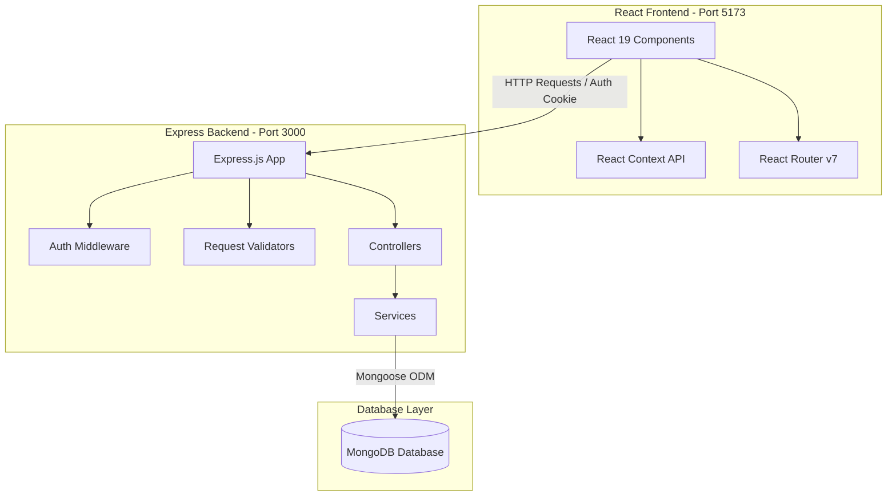

# 🚗 Uber Clone App

Welcome to the **Uber Clone App** repository! This is a modern, high-performance, full-stack application built to clone core ridesharing user and captain (driver) flows. It is divided into two primary sub-projects: an **Express.js API Backend** and a **React 19 Frontend**.

---

## 🏗️ Repository Architecture

This codebase is organized as a monorepo containing distinct frontend and backend environments:



---

## 📂 Repository Structure

The root directory contains the following projects:

*   **[Backend](file:///d:/Uber%20Clone%20App/Backend/)**: Node.js & Express API backend handling business logic, MongoDB persistence, security, and authentication routes.
    *   *For full backend API documentation and endpoint details, see the [Backend README](file:///d:/Uber%20Clone%20App/Backend/README.md).*
*   **[Frontend](file:///d:/Uber%20Clone%20App/Frontend/)**: Single Page Application built using React 19, Vite, Tailwind CSS v4, and React Router v7.
    *   *For route listings and UI state context details, see the [Frontend README](file:///d:/Uber%20Clone%20App/Frontend/README.md).*

---

## 🚀 Getting Started

### 📋 Prerequisites

To run this application locally, you will need:
*   [Node.js](https://nodejs.org/) (v18.x or higher recommended)
*   [MongoDB](https://www.mongodb.com/) (local instance running or a MongoDB Atlas URI)
*   [npm](https://www.npmjs.com/) (Node Package Manager)

---

### 🔧 Complete Local Setup

#### Step 1: Clone and install Backend dependencies
1. Navigate into the backend directory:
   ```bash
   cd Backend
   ```
2. Install the node modules:
   ```bash
   npm install
   ```
3. Create your backend `.env` file:
   ```env
   PORT=3000
   MONGO_URI=mongodb://localhost:27017/uber-clone
   JWT_SECRET=your_super_secret_jwt_key
   ```
4. Start the backend server:
   *   **Development mode** (with auto-reload using `nodemon`):
       ```bash
       npm run dev
       ```
   *   **Production mode**:
       ```bash
       npm start
       ```

#### Step 2: Install Frontend dependencies
1. Open a new terminal window and navigate into the frontend directory:
   ```bash
   cd Frontend
   ```
2. Install dependencies:
   ```bash
   npm install
   ```
3. Create your frontend `.env` file:
   ```env
   VITE_API_URL=http://localhost:3000
   ```
4. Start the frontend web application:
   ```bash
   npm run dev
   ```
   *The application will open and run locally at `http://localhost:5173`.*

---

## 🧪 Development Tools & Linters

*   **Linter:** We use [Oxlint](https://oxc.rs/) in the frontend directory for ultra-fast compilation checks. Run linting checks using:
    ```bash
    npm run lint
    ```
*   **Database Admin:** You can use MongoDB Compass or Mongo Shell to verify user registration profiles and captains collections created under the `uber-clone` database.
